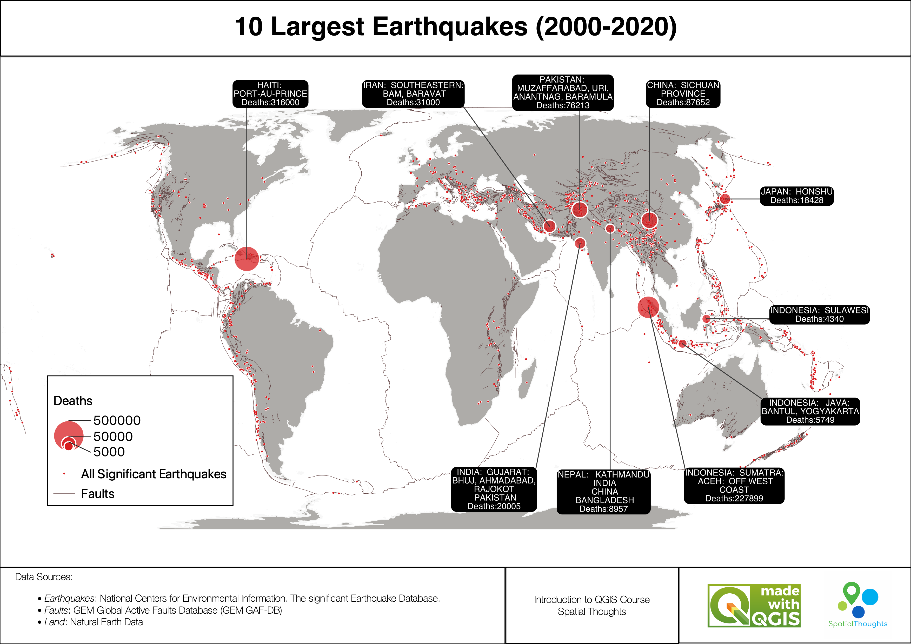
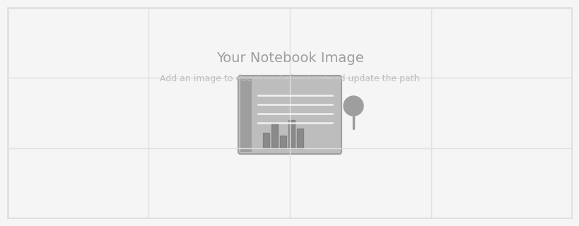

---
hide:
  - toc
  - navigation
---
<!--
CHECKLIST FOR THIS PAGE:
- [ ] Replace the two placeholder cards (marked [YOUR PROJECT ...]) with your real projects
- [ ] For each project: add a thumbnail image to docs/assets/images/ and update the path below
- [ ] For each project: create a project page by copying sample-project.md
- [ ] For each project: add a nav entry in mkdocs.yml (see the comments there)
- [ ] Delete placeholder cards you don't need yet
-->

# Projects

A selection of my geospatial projects. Click any card to see the full write-up.

**[10 Largest Earthquakes by Death Toll](largest-earthquakes.md)**

A thematic world map of the 10 largest earthquakes from 2000 to 2020, built in QGIS from the NOAA significant earthquake database. Circle sizes show the death toll, and the map is overlaid on global active faults to show how the deadliest events relate to tectonic boundaries.

| Tool | Purpose |
|------|---------|
| QGIS | Data processing, symbology, and map layout |
| Select by Attribute | Filtering the 10 largest earthquakes by magnitude |
| QGIS expressions | Generating the callout labels |
| Equal Earth projection | Area-preserving world map display |

[View Project →](largest-earthquakes.md){ .md-button }

**[Sample Notebook](sample-notebook.ipynb)**

[YOUR PROJECT DESCRIPTION — one or two sentences: what you did, what data you used,
and what you found or built.]

`Python` `pandas` `Folium`

[View Project →](sample-notebook.ipynb){ .md-button }

